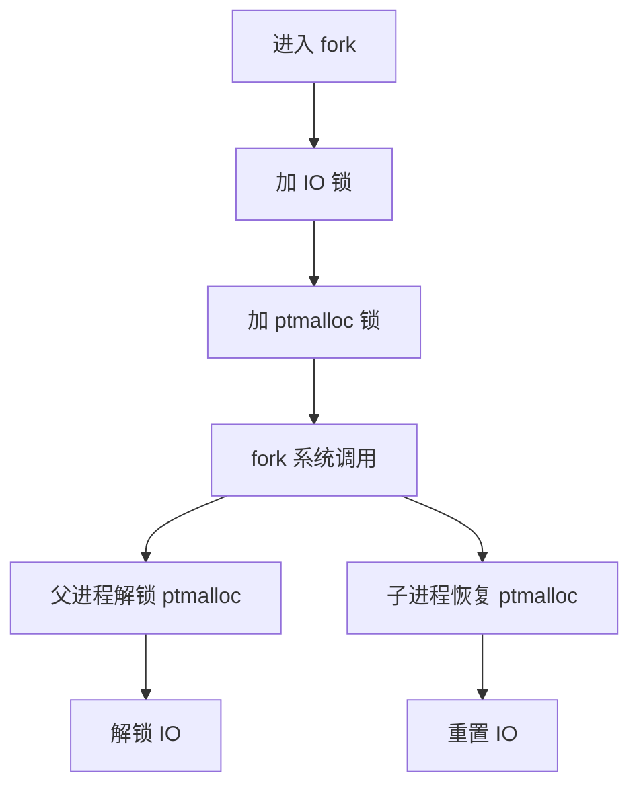
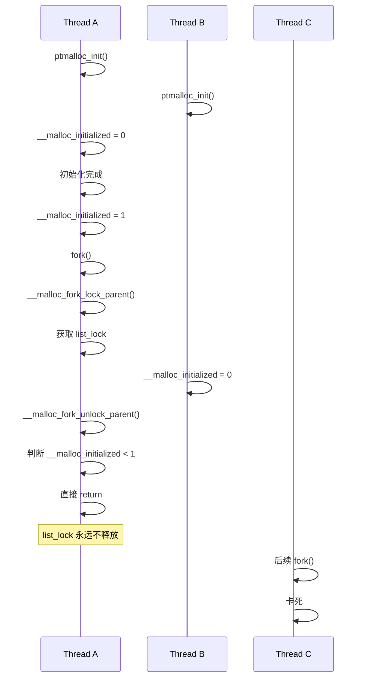

某日客户反馈，软件在 CentOS 7 上突然离线。

登录机器后发现进程还在，但 CPU 使用率为 0，也没有任何日志输出。用 gdb 附加上去一看，程序已经陷入死锁。

更诡异的是，卡住的位置竟然是 `fork()`。

<!-- more -->

```
(gdb) bt
#0  __lll_lock_wait_private () at ../nptl/sysdeps/unix/sysv/linux/x86_64/lowlevellock.S:95
#1  0x00007ffff73d0b17 in _L_lock_16342 () from /lib64/libc.so.6
#2  0x00007ffff73cd4b0 in __malloc_fork_lock_parent () at arena.c:240
#3  0x00007ffff740dadc in __libc_fork () at ../nptl/sysdeps/unix/sysv/linux/fork.c:123
#4  0x00000000004007e0 in fork_thread_start (arg=0x0) at lock.c:18
#5  0x00007ffff7bc6ea5 in start_thread (arg=0x7ffff4dfc700) at pthread_create.c:307
#6  0x00007ffff7446b0d in clone () at ../sysdeps/unix/sysv/linux/x86_64/clone.S:111
```

看到这里第一反应是：

> `fork()` 是 libc 的基础函数，怎么可能死锁？

## 问题复现

问题依赖于 glibc 2.17，直接在 CentOS 7 上即可复现。

下面代码是定位最终问题后，抽取出的核心代码逻辑，方便大家调试复现：

```c
#include <pthread.h>
#include <malloc.h>
#include <stdio.h>

void *thread_start(void *arg) {
  malloc_trim(0);
  while (1) {
    // worker
    sleep(10);
  }
}

void *fork_thread_start(void *arg) {
  if (fork() == 0) {
    return 0;
  }

  while (1) {
    // wait child exit
    sleep(10);
  }
}

int main() {
  pthread_t tid;
  pthread_t tid2;
  pthread_t tid3;
  pthread_t tid4;

  pthread_create(&tid, NULL, &thread_start, NULL);
  pthread_create(&tid2, NULL, &thread_start, NULL);
  pthread_create(&tid3, NULL, &fork_thread_start, NULL);
  pthread_create(&tid4, NULL, &fork_thread_start, NULL);

  pthread_join(tid, NULL);
  pthread_join(tid2, NULL);
  pthread_join(tid3, NULL);
  pthread_join(tid4, NULL);

  return 0;
}
```

死锁时所有线程栈如下：

```
(gdb) thread apply all bt
Thread 5 (Thread 0x7ffff4dfc700 (LWP 43257)):
#0  __lll_lock_wait_private () at ../nptl/sysdeps/unix/sysv/linux/x86_64/lowlevellock.S:95
#1  0x00007ffff73d0b17 in _L_lock_16342 () from /lib64/libc.so.6
#2  0x00007ffff73cd4b0 in __malloc_fork_lock_parent () at arena.c:240
#3  0x00007ffff740dadc in __libc_fork () at ../nptl/sysdeps/unix/sysv/linux/fork.c:123
#4  0x00000000004007e0 in fork_thread_start (arg=0x0) at lock.c:18
#5  0x00007ffff7bc6ea5 in start_thread (arg=0x7ffff4dfc700) at pthread_create.c:307
#6  0x00007ffff7446b0d in clone () at ../sysdeps/unix/sysv/linux/x86_64/clone.S:111

Thread 4 (Thread 0x7ffff55fd700 (LWP 43256)):
#0  0x00007ffff740d9fd in nanosleep () at ../sysdeps/unix/syscall-template.S:81
#1  0x00007ffff740d894 in __sleep (seconds=0) at ../sysdeps/unix/sysv/linux/sleep.c:137
#2  0x00000000004007ff in fork_thread_start (arg=0x0) at lock.c:24
#3  0x00007ffff7bc6ea5 in start_thread (arg=0x7ffff55fd700) at pthread_create.c:307
#4  0x00007ffff7446b0d in clone () at ../sysdeps/unix/sysv/linux/x86_64/clone.S:111

Thread 3 (Thread 0x7ffff5dfe700 (LWP 43255)):
#0  __lll_lock_wait_private () at ../nptl/sysdeps/unix/sysv/linux/x86_64/lowlevellock.S:95
#1  0x00007ffff73d0e18 in _L_lock_21569 () from /lib64/libc.so.6
#2  0x00007ffff73cf803 in __malloc_trim (s=0) at malloc.c:4536
#3  0x00000000004007c3 in thread_start (arg=0x0) at lock.c:11
#4  0x00007ffff7bc6ea5 in start_thread (arg=0x7ffff5dfe700) at pthread_create.c:307
#5  0x00007ffff7446b0d in clone () at ../sysdeps/unix/sysv/linux/x86_64/clone.S:111

Thread 2 (Thread 0x7ffff65ff700 (LWP 43254)):
#0  0x00007ffff740d9fd in nanosleep () at ../sysdeps/unix/syscall-template.S:81
#1  0x00007ffff740d894 in __sleep (seconds=0) at ../sysdeps/unix/sysv/linux/sleep.c:137
#2  0x00000000004007cd in thread_start (arg=0x0) at lock.c:13
#3  0x00007ffff7bc6ea5 in start_thread (arg=0x7ffff65ff700) at pthread_create.c:307
#4  0x00007ffff7446b0d in clone () at ../sysdeps/unix/sysv/linux/x86_64/clone.S:111

Thread 1 (Thread 0x7ffff7fecf00 (LWP 43253)):
#0  0x00007ffff7bc8017 in pthread_join (threadid=140737326872320, thread_return=0x0) at pthread_join.c:90
#1  0x0000000000400888 in main () at lock.c:39
```

可以看到：

* 一个线程卡在 `__malloc_fork_lock_parent()`
* 一个线程卡在 `malloc_trim()`
* 另一个 fork 线程已经返回

整个过程没有使用任何用户态锁，全部都是 libc 内部逻辑。

## 两个疑点

### 1. 初始化流程非常简单

出问题时程序还处于早期初始化阶段，没有复杂业务逻辑，也没有任何显式加锁。

### 2. fork 怎么会死锁？

`fork()` 是 libc 最基础的系统调用封装，本不应该出现这种问题。

来来回回 review 了数遍代码，始终没有发现异常。

## 怀疑 jemalloc 和 ptmalloc 混用

继续分析堆栈：

```
fork
 └── __malloc_fork_lock_parent
```

而另一个线程：

```
malloc_trim
 └── __malloc_trim
```

这时想起一个历史遗留：

> 整个程序已经切换到了 jemalloc，但某些地方仍然在调用 ptmalloc 的 `malloc_trim()`。

于是怀疑：

> jemalloc 与 ptmalloc 混用导致了并发 bug。

沿着这个方向分析了几天，一无所获。

最终只好下载 glibc 2.17 源码，对着堆栈逐行分析。

## fork 内部做了什么

简化后，`fork()` 的流程如下：



整个加锁、解锁流程看起来完全对称，没有明显问题。

翻遍了 GNU Bugzilla 上关于 `fork()` 的死锁问题，始终找不到和现象一致的 issue。

最后只好回到最原始的方法：对照 glibc 源码和自己的代码，一行一行地比对，猜测哪里可能存在竞争窗口。

## 真正的问题：__malloc_initialized

在 glibc 2.17 中：

```c
int __malloc_initialized = -1;
```

它有三个状态：

* -1：未初始化
* 0：初始化中
* 1：初始化完成

初始化过程：

```c
ptmalloc_init()
{
    if (__malloc_initialized >= 0)
        return;

    __malloc_initialized = 0;

    ...

    __malloc_initialized = 1;
}
```

而 fork 前后的加锁解锁：

```c
__malloc_fork_lock_parent()
{
    if (__malloc_initialized < 1)
        return;

    加锁...
}

__malloc_fork_unlock_parent()
{
    if (__malloc_initialized < 1)
        return;

    解锁...
}
```

看到这里，问题终于浮现出来。

### ptmalloc_init 本身没有锁

整个初始化过程没有任何同步保护。

这里有一个非常极限的临界区，B 线程在 A 线程将 `__malloc_initialized` 赋值为 `0` 前通过 `__malloc_initialized >= 0`，然后在 `__malloc_fork_lock_parent()` 前 B 线程没有被调度到，两个条件缺一不可。

```c
if (__malloc_initialized >= 0)
    return;

__malloc_initialized = 0;

```

于是可能出现下面的时序：



于是：

> 锁加上了，但由于 `__malloc_initialized` 被其它线程重新改成 0，导致解锁逻辑没有执行。

最终所有后续 fork 全部卡死。

## 为什么会触发？

正常情况下，这个问题几乎不会出现。

因为，程序启动阶段只要发生一次 `malloc`，ptmalloc 就已经初始化完成。即使 main 中没有调用 malloc，创建线程时内部也会进行内存分配。因此正常程序几乎不会遇到这里的竞争窗口。

而我们的情况非常特殊：

* 使用 jemalloc 代替 ptmalloc；
* 内存分配都不会进入 glibc malloc；
* 却仍然调用了 ptmalloc 的 `malloc_trim()`；
* 多个线程同时进入初始化流程；
* 又恰好有线程在执行 fork；

最终触发了这个极其罕见的竞争条件。

## glibc 的后续演进

后续在 glibc 的提交 [bminor/glibc@cc35896](https://github.com/bminor/glibc/commit/cc35896ea3e4532919ec81b17f36299117debe79)（随 glibc 2.34 发布）中，`__malloc_initialized` 被简化为 `bool` 类型。

初始化逻辑也随之变得直接：

```c
static bool __malloc_initialized = false;

static void ptmalloc_init(void)
{
    if (__malloc_initialized)
        return;

    __malloc_initialized = true;

    // do something
}
```

在这个版本里，三态状态机被彻底废弃，`-1 / 0 / 1` 消失，初始化只需表达一个事实：**是否已经完成**。

fork 侧的代码也随之更简洁：

```c
void __malloc_fork_lock_parent(void)
{
    if (!__malloc_initialized)
        return;

    __libc_lock_lock(list_lock);
    ...
}
```

后续还有一次更关键的调整：

[bminor/glibc@25d3794](https://github.com/bminor/glibc/commit/25d37948c9f3f483d63302b9967b975d3bd74a4e)（随 glibc 2.42 发布） `ptmalloc_init` 被提前到了 `__libc_early_init` 阶段执行。

换句话说：**初始化从“可能并发发生的运行时行为”，变成了“进程启动阶段的确定行为”。**

我们现在碰到的问题彻底不会出现了。

## 现有问题修改方式

在我们的场景中，最快捷且简单的规避方式是：

在 `main()` 中显式调用一次：

```c
malloc_trim(0);
```

目的并不是“清理内存”，而是强制触发 ptmalloc 初始化，使其尽早完成。

## 总结

这个问题最后确实落在 glibc 身上，但我认为这不能简单的归结于“这是 glibc 的 bug”。

因为我认为 glibc 的设计里这里 `ptmalloc_init` 不会产生并发，我们的系统恰好让 `ptmalloc_init` 产生了并发，最终问题变成了一个组合条件，而不是单点错误。

我不知道 glibc 后续的修复是否是发现了我们遇见的这个问题，至少在提交记录中未提及。但新版本的 glibc 也不会再触发这个问题了。

至于那个在 `main()` 里莫名其妙的：

```c
malloc_trim(0);
```

希望未来某一天，不会有人觉得这是屎山代码，然后顺手把它删掉。

毕竟，每一行看起来毫无道理的代码背后，可能都有一个神奇的 bug。
